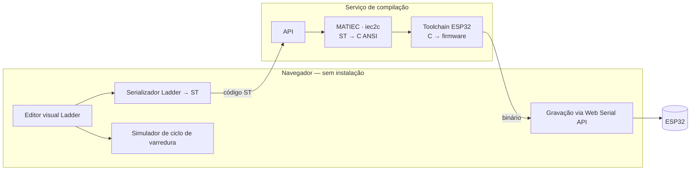

# LadderFlow

**Plataforma web para programação em linguagem Ladder de microcontroladores ESP32.**

Integra, em um único fluxo executado no navegador e sem instalação local, o ciclo completo de **edição visual → simulação → gravação** de lógica Ladder conforme a IEC 61131-3.


---

## Sumário

- [Visão geral](#visão-geral)
- [Funcionalidades](#funcionalidades)
- [Arquitetura](#arquitetura)
- [Tecnologias](#tecnologias)
- [Requisitos](#requisitos)
- [Instalação e execução](#instalação-e-execução)
- [Estrutura do repositório](#estrutura-do-repositório)
- [Escopo e limitações](#escopo-e-limitações)
- [Licença e propriedade intelectual](#licença-e-propriedade-intelectual)
- [Créditos e referências](#créditos-e-referências)

---

## Visão geral

A programação de controladores lógicos em linguagem Ladder para microcontroladores de baixo custo depende hoje de ferramentas desktop que exigem instalação do editor, configuração de toolchain de compilação e instalação de drivers de comunicação serial. Esse conjunto de pré-requisitos constitui barreira de entrada para estudantes, profissionais iniciantes e laboratórios de ensino de automação.

O LadderFlow elimina esses pré-requisitos ao executar a edição e a simulação inteiramente no navegador e ao delegar apenas a compilação a um serviço remoto. A gravação no dispositivo ocorre diretamente do navegador, via Web Serial API, sem instalação de qualquer software no computador do usuário.

## Funcionalidades

- **Editor visual Ladder** — construção de diagramas em grade, no navegador, com os seguintes elementos da IEC 61131-3: contato NA, contato NF, bobina simples, bobina SET, bobina RESET, ramo paralelo (OU) e contador crescente (CTU). Suporta até 8 entradas e 8 saídas digitais, mapeadas para GPIO do ESP32.
- **Serialização para Structured Text** — conversão contínua do diagrama para ST, formato canônico definido pela IEC 61131-3, atualizada a cada edição.
- **Simulador de ciclo de varredura** — executa a lógica do diagrama no navegador (lê entradas → resolve os degraus → escreve saídas), com controles Executar/Pausar, Passo e Reiniciar, e valores de variáveis ao vivo. É um segundo executor independente do serializador: os dois nunca compartilham a leitura de topologia do diagrama, para que a comparação entre eles tenha valor de medição (ver `docs/limitacoes-declaradas.md`, item 9).
- **Download do projeto** — o diagrama Ladder como `.json` (para reabrir depois), o Structured Text gerado como `.st`, PLCopen XML e um `.zip` com as três imagens de flash do ESP32 (bootloader, tabela de partições e aplicação) mais instruções de gravação. Os formatos de texto e JSON são gerados no navegador; o firmware exige o serviço de compilação e, se ainda não houver pacote válido para a lógica atual, a IDE compila antes do download e avisa o usuário.
- **Persistência local** — o projeto em edição é salvo no `localStorage` do navegador e recarregado na abertura seguinte.
- **Compilação remota** — geração de firmware a partir do código ST, sem toolchain na máquina do usuário.
- **Gravação via navegador** — transferência do firmware ao ESP32 pela Web Serial API, sem drivers ou instaladores. **O transporte Web Serial nunca foi exercitado contra um ESP32 físico**: o fluxo foi verificado até a tentativa de conexão (inclusive em Chromium automatizado) e a gravação do mesmo pacote foi comprovada por linha de comando (`esptool`) contra um ESP32 emulado em QEMU, mas nenhum dispositivo real foi gravado. Detalhe em `docs/limitacoes-declaradas.md`.
- **Temas claro e escuro** na interface.

## Arquitetura

Arquitetura cliente-servidor. O cliente executa integralmente no navegador; ao servidor cabe exclusivamente a etapa de compilação.



**Fluxo de execução**

1. O usuário constrói a lógica no editor Ladder.
2. A partir do mesmo diagrama, dois caminhos independentes rodam em paralelo
   no navegador: o **serializador** o traduz para Structured Text de forma
   contínua (a cada edição), e o **simulador** o executa ciclo a ciclo para
   validar a lógica antes da gravação. O simulador lê o diagrama diretamente
   — não reaproveita a leitura de topologia do serializador, por decisão de
   projeto que sustenta a comparação entre os dois (ver
   `docs/limitacoes-declaradas.md`, item 9).
3. O código ST é compilado no servidor, gerando o firmware.
4. O binário é gravado no ESP32 pelo navegador.

## Tecnologias

**Front-end** — React, Vite, Tailwind CSS, esptool-js, Web Serial API
**Back-end** — FastAPI (Python), MATIEC (`iec2c`), ESP-IDF (toolchain de compilação ESP32)
**Infraestrutura** — Docker, Docker Compose
**Norma de referência** — IEC 61131-3 (Ladder e Structured Text)

## Requisitos

| Requisito | Especificação |
|---|---|
| Navegador | Chrome ou Edge 89+ (suporte à Web Serial API) |
| Contexto de execução | HTTPS ou `localhost` |
| Hardware | ESP32 (variante clássica) |
| Ambiente de desenvolvimento (stack completo) | Git, Docker com Compose v2 |
| Ambiente de desenvolvimento (só front-end) | Git, Node.js 22 |

## Instalação e execução

Repositório: [https://github.com/andre-m-t/ladder-web-ide](https://github.com/andre-m-t/ladder-web-ide)

```bash
git clone https://github.com/andre-m-t/ladder-web-ide.git
cd ladder-web-ide
```

Há dois modos de uso: **stack completo** (editor + compilação + gravação) e **somente front-end** (editor e simulação, sem compilar nem gravar). Em ambos, abra a aplicação em **Chrome ou Edge 89+** em `http://localhost:5173`.

### Stack completo (Docker) — Linux e Windows

**Pré-requisitos**

- Git
- [Docker](https://docs.docker.com/get-docker/) com **Compose v2** (`docker compose`, não o binário legado `docker-compose`)
- No Windows: [Docker Desktop](https://docs.docker.com/desktop/setup/install/windows-install/) com backend WSL2 recomendado

**Passo a passo — Linux**

1. Clone o repositório (comando acima) e entre na pasta `ladder-web-ide`.
2. Copie o arquivo de ambiente: `cp .env.example .env`
3. Suba os serviços (a primeira vez constrói as imagens): `docker compose up --build`
4. Aguarde o backend ficar saudável (o healthcheck em `/health` pode levar cerca de um minuto na primeira subida).
5. Abra no navegador: `http://localhost:5173`

**Passo a passo — Windows (PowerShell)**

1. Clone o repositório e entre na pasta `ladder-web-ide`.
2. Copie o arquivo de ambiente: `Copy-Item .env.example .env`
3. Suba os serviços: `docker compose up --build`
4. Aguarde o backend ficar saudável.
5. Abra no navegador: `http://localhost:5173`

| Serviço | Endereço padrão |
|---|---|
| Aplicação (IDE) | `http://localhost:5173` |
| API de compilação | `http://localhost:8000` |
| Documentação da API (Swagger) | `http://localhost:8000/docs` |

**O que esperar**

- A **primeira** construção da imagem do backend baixa vários gigabytes (cerca de **7,3 GB** medidos na imagem de desenvolvimento) e pode demorar bastante; execuções seguintes usam o cache do Docker.
- Nenhuma toolchain precisa ser instalada na máquina host: o contêiner do backend traz o MATIEC (`iec2c`) e o ESP-IDF (imagem oficial da Espressif).
- As compilações de firmware usam o volume nomeado `esp-build-cache` para builds incrementais (cerca de **66 s** no primeiro build e **11–13 s** nos seguintes, em ambiente de desenvolvimento). `docker compose down -v` apaga esse volume e o próximo build volta a ser frio.

**Portas e variáveis**

As portas padrão são **8000** (API) e **5173** (front-end), definidas por `BACKEND_PORT` e `FRONTEND_PORT` no `.env`. Se alterar `BACKEND_PORT`, ajuste também `VITE_API_URL` e `CORS_ORIGINS` no mesmo arquivo — eles **não** seguem a porta do backend automaticamente. Lista completa em [`.env.example`](.env.example).

### Somente front-end (sem Docker)

Útil para trabalhar no editor e no simulador sem baixar a imagem do backend.

**Pré-requisitos:** Git e **Node.js 22** ([nodejs.org](https://nodejs.org/) ou gerenciador de versões). Os comandos abaixo são os mesmos no Linux e no Windows (PowerShell ou terminal integrado).

1. Clone o repositório e entre na pasta do projeto.
2. Entre na pasta do front-end e instale as dependências:

```bash
cd frontend
npm install
npm run dev
```

3. Abra `http://localhost:5173` no navegador.

**Comportamento sem o serviço de compilação**

| Funciona | Não funciona |
|---|---|
| Editor Ladder e projeto em Structured Text | Compilar (botão **Compilar**) |
| Simulador de ciclo de varredura e ambientes (ex.: portão) | Gravar no ESP32 (botão **Gravar**) |
| Temas claro/escuro, painel de variáveis, console | Download de **Firmware ESP32 (.zip)** |
| Persistência do projeto no `localStorage` do navegador | |
| Download de **Ladder (.json)**, **Structured Text (.st)** e **PLCopen XML** (gerados no navegador) | |

Na abertura, o console da IDE registra que o **servidor de compilação está indisponível** (nada responde em `http://localhost:8000`, valor padrão de `VITE_API_URL`). Tentar compilar resulta em erro de rede. **Gravar** permanece desabilitado até existir um pacote de firmware compilado com sucesso.

Para compilar ou baixar firmware, use o **stack completo** com Docker ou aponte `VITE_API_URL` para uma API já em execução e reinicie o `npm run dev`.

**Gravação do firmware fora da IDE**

O menu **Baixar → Firmware ESP32 (.zip)** entrega as mesmas três imagens usadas na gravação pela Web Serial, com um arquivo `gravacao.txt` (endereços e exemplo de comando `esptool`). Isso permite gravar com ferramentas como `esptool`, Flash Download Tool ou fluxos web de terceiros. **Gravar esse pacote em um ESP32 físico ainda não foi validado neste projeto** — ver [`docs/limitacoes-declaradas.md`](docs/limitacoes-declaradas.md).

### Testes do back-end

Incluem compilação real de Structured Text pelo MATIEC e geração de firmware pelo ESP-IDF:

```bash
docker compose run --rm backend pytest -v                  # suíte completa (o primeiro build pode levar minutos)
docker compose run --rm backend pytest -v -m "not slow"    # sem testes que geram firmware
```

## Estrutura do repositório

```
.
├── frontend/          Aplicação web — editor, simulador e gravação
├── backend/           Serviço de compilação — API e integração com as toolchains
│   └── firmware/      Projeto ESP-IDF — ciclo de varredura e mapeamento de I/O
├── docs/              Método de desenvolvimento, documentação técnica e validação
├── scripts/           Utilitários do projeto (ex.: empacotamento para depósito)
├── docker-compose.yml
├── THIRD_PARTY.md     Componentes de terceiros e suas licenças
└── .env.example
```

O desenvolvimento segue o método de *Spec-Driven Development* descrito em
[`docs/README.md`](docs/README.md).

## Escopo e limitações

- Validação em nível lógico (3,3 V, GPIO). Interface para I/O industrial de campo e requisitos de segurança funcional estão fora do escopo.
- A gravação requer navegador com suporte à Web Serial API (Chromium e derivados).
- O alvo é o ESP32 clássico; demais variantes da família não são validadas.
- Prova de conceito de caráter acadêmico e educacional; não constitui substituto de ferramenta industrial certificada.

A lista completa e detalhada de limitações conhecidas — cobertura parcial da
norma, comportamentos deliberados do editor e do simulador, e o que depende
exclusivamente de hardware ainda não disponível — está em
[`docs/limitacoes-declaradas.md`](docs/limitacoes-declaradas.md).

## Licença e propriedade intelectual

Este software encontra-se em processo de registro de programa de computador junto ao INPI (Lei nº 9.609/1998). **Até a conclusão do processo, todos os direitos são reservados** e nenhuma licença de uso, cópia, modificação ou distribuição é concedida.

Os termos de licenciamento serão definidos posteriormente, em conjunto com o Núcleo de Inovação Tecnológica da instituição.

**Componentes de terceiros utilizados**

| Componente | Licença |
|---|---|
| MATIEC | GPL-3.0 |
| ESP-IDF (Espressif) | Apache-2.0 |
| esptool-js (Espressif) | Apache-2.0 |
| React, Vite, Tailwind CSS, FastAPI | MIT / permissivas |

A relação completa, com a forma de uso de cada componente, está em [`THIRD_PARTY.md`](THIRD_PARTY.md).

O MATIEC e o ESP-IDF são invocados como processos independentes, não incorporados ao código-fonte deste projeto. Eventuais obrigações de conformidade decorrentes da redistribuição de componentes sob GPL devem ser observadas na distribuição de imagens de contêiner.

## Créditos e referências

- **IEC 61131-3** — Programmable controllers, Part 3: Programming languages.
- ALVES, T. R. et al. *OpenPLC: An open source alternative to automation.* IEEE GHTC, 2014.
- SOUSA, M.; CARVALHO, A. *An IEC 61131-3 compiler for the MatPLC.* IEEE EFTA, 2003.
- ESPRESSIF SYSTEMS. *esptool-js — flasher tool for Espressif chips.*

---

Desenvolvido no âmbito do Trabalho de Conclusão de Curso em Engenharia de Computação — Instituto Federal do Triângulo Mineiro.
