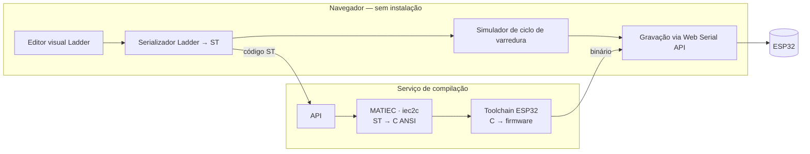

# LadderFlow

**Plataforma web para programação em linguagem Ladder de microcontroladores ESP32.**

Integra, em um único fluxo executado no navegador e sem instalação local, o ciclo completo de **edição visual → simulação → gravação** de lógica Ladder conforme a IEC 61131-3.


---

## Sumário

- [Visão geral](#visão-geral)
- [Funcionalidades](#funcionalidades)
- [Arquitetura](#arquitetura)
- [Tecnologias](#tecnologias)
- [Requisitos](#requisitos)
- [Instalação e execução](#instalação-e-execução)
- [Estrutura do repositório](#estrutura-do-repositório)
- [Roadmap](#roadmap)
- [Escopo e limitações](#escopo-e-limitações)
- [Licença e propriedade intelectual](#licença-e-propriedade-intelectual)
- [Créditos e referências](#créditos-e-referências)

---

## Visão geral

A programação de controladores lógicos em linguagem Ladder para microcontroladores de baixo custo depende hoje de ferramentas desktop que exigem instalação do editor, configuração de toolchain de compilação e instalação de drivers de comunicação serial. Esse conjunto de pré-requisitos constitui barreira de entrada para estudantes, profissionais iniciantes e laboratórios de ensino de automação.

O LadderFlow elimina esses pré-requisitos ao executar a edição e a simulação inteiramente no navegador e ao delegar apenas a compilação a um serviço remoto. A gravação no dispositivo ocorre diretamente do navegador, via Web Serial API, sem instalação de qualquer software no computador do usuário.

## Funcionalidades

- **Editor visual Ladder** — construção de diagramas de contatos e bobinas em canvas interativo, executado no navegador.
- **Serialização para Structured Text** — conversão do diagrama para ST, formato canônico definido pela IEC 61131-3.
- **Simulador de ciclo de varredura** — validação da lógica no cliente, antes da gravação em hardware.
- **Compilação remota** — geração de firmware a partir do código ST, sem toolchain na máquina do usuário.
- **Gravação via navegador** — transferência do firmware ao ESP32 pela Web Serial API, sem drivers ou instaladores.

## Arquitetura

Arquitetura cliente-servidor. O cliente executa integralmente no navegador; ao servidor cabe exclusivamente a etapa de compilação.



**Fluxo de execução**

1. O usuário constrói a lógica no editor Ladder.
2. O diagrama é serializado para Structured Text.
3. A lógica é validada no simulador de ciclo de varredura.
4. O código ST é compilado no servidor, gerando o firmware.
5. O binário é gravado no ESP32 pelo navegador.

## Tecnologias

**Front-end** — React, Vite, Tailwind CSS, esptool-js, Web Serial API
**Back-end** — FastAPI (Python), MATIEC (`iec2c`), ESP-IDF (toolchain de compilação ESP32)
**Infraestrutura** — Docker, Docker Compose
**Norma de referência** — IEC 61131-3 (Ladder e Structured Text)

## Requisitos

| Requisito | Especificação |
|---|---|
| Navegador | Chrome ou Edge 89+ (suporte à Web Serial API) |
| Contexto de execução | HTTPS ou `localhost` |
| Hardware | ESP32 (variante clássica) |
| Ambiente de desenvolvimento | Docker e Docker Compose |

## Instalação e execução

```bash
git clone https://github.com/<organizacao>/ladderflow.git
cd ladderflow
cp .env.example .env
docker compose up --build
```

| Serviço | Endereço |
|---|---|
| Aplicação | `http://localhost:5173` |
| API | `http://localhost:8000` |
| Documentação da API | `http://localhost:8000/docs` |

Nenhuma instalação manual de toolchain é necessária: o contêiner do serviço de compilação traz as duas etapas prontas — o MATIEC construído a partir do fonte e o ESP-IDF, vindo da imagem oficial da Espressif. A primeira construção da imagem baixa alguns gigabytes e demora; as seguintes usam o cache do Docker.

O diretório de build do ESP-IDF vive em um volume nomeado (`esp-build-cache`), de modo que as compilações sejam incrementais entre execuções: em máquina de desenvolvimento, a primeira compilação leva cerca de 66 s e as seguintes 11–13 s. `docker compose down -v` descarta o volume e o build seguinte volta a ser frio.

**Testes do back-end** — incluem a compilação real de um programa Structured Text pelo MATIEC e a geração do firmware pelo ESP-IDF:

```bash
docker compose run --rm backend pytest -v            # tudo (o primeiro build leva minutos)
docker compose run --rm backend pytest -v -m "not slow"   # sem a geração de firmware
```

## Estrutura do repositório

```
.
├── frontend/          Aplicação web — editor, simulador e gravação
├── backend/           Serviço de compilação — API e integração com as toolchains
│   └── firmware/      Projeto ESP-IDF — ciclo de varredura e mapeamento de I/O
├── docs/              Método de desenvolvimento, documentação técnica e validação
├── scripts/           Utilitários do projeto (ex.: empacotamento para depósito)
├── docker-compose.yml
├── THIRD_PARTY.md     Componentes de terceiros e suas licenças
└── .env.example
```

O desenvolvimento segue o método de *Spec-Driven Development* descrito em
[`docs/README.md`](docs/README.md).

## Roadmap

- [x] Ambiente de build containerizado com MATIEC e toolchain ESP32
- [ ] Pipeline completo de compilação e gravação (fatia vertical mínima)
- [ ] Editor visual Ladder — contatos, bobinas e serialização para ST
- [ ] Simulador de ciclo de varredura
- [ ] Integração do ciclo completo e tratamento de erros
- [ ] Validação funcional em bancada e coleta de métricas
- [ ] Ampliação da cobertura de elementos da IEC 61131-3

## Escopo e limitações

- Validação em nível lógico (3,3 V, GPIO). Interface para I/O industrial de campo e requisitos de segurança funcional estão fora do escopo.
- Contempla-se um subconjunto dos elementos da IEC 61131-3, não a totalidade da norma.
- A gravação requer navegador com suporte à Web Serial API (Chromium e derivados).
- O alvo é o ESP32 clássico; demais variantes da família não são validadas.
- Prova de conceito de caráter acadêmico e educacional; não constitui substituto de ferramenta industrial certificada.

## Licença e propriedade intelectual

Este software encontra-se em processo de registro de programa de computador junto ao INPI (Lei nº 9.609/1998). **Até a conclusão do processo, todos os direitos são reservados** e nenhuma licença de uso, cópia, modificação ou distribuição é concedida.

Os termos de licenciamento serão definidos posteriormente, em conjunto com o Núcleo de Inovação Tecnológica da instituição.

**Componentes de terceiros utilizados**

| Componente | Licença |
|---|---|
| MATIEC | GPL-3.0 |
| ESP-IDF (Espressif) | Apache-2.0 |
| esptool-js (Espressif) | Apache-2.0 |
| React, Vite, Tailwind CSS, FastAPI | MIT / permissivas |

A relação completa, com a forma de uso de cada componente, está em [`THIRD_PARTY.md`](THIRD_PARTY.md).

O MATIEC e o ESP-IDF são invocados como processos independentes, não incorporados ao código-fonte deste projeto. Eventuais obrigações de conformidade decorrentes da redistribuição de componentes sob GPL devem ser observadas na distribuição de imagens de contêiner.

## Créditos e referências

- **IEC 61131-3** — Programmable controllers, Part 3: Programming languages.
- ALVES, T. R. et al. *OpenPLC: An open source alternative to automation.* IEEE GHTC, 2014.
- SOUSA, M.; CARVALHO, A. *An IEC 61131-3 compiler for the MatPLC.* IEEE EFTA, 2003.
- ESPRESSIF SYSTEMS. *esptool-js — flasher tool for Espressif chips.*

---

Desenvolvido no âmbito do Trabalho de Conclusão de Curso em Engenharia de Computação — Instituto Federal do Triângulo Mineiro.
